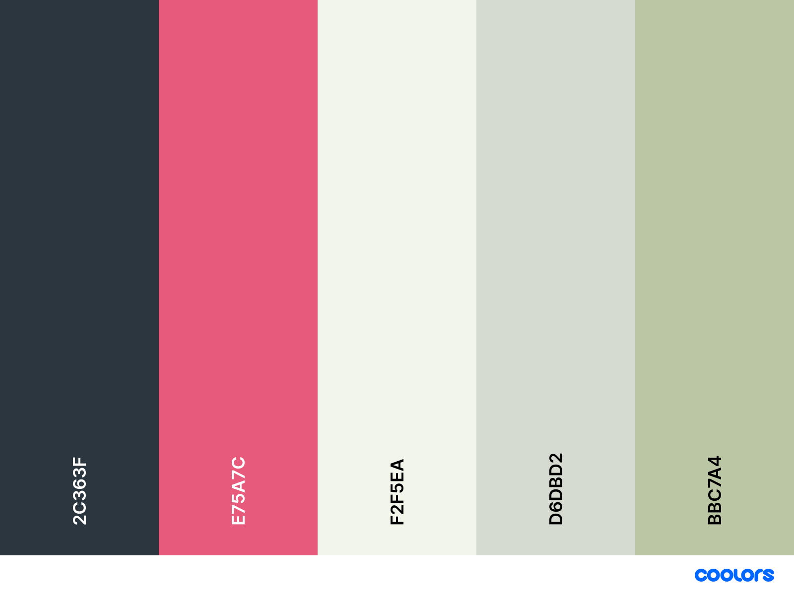

URL: [vul hier zelf de URL in waar je website gehost is!] 

# Vervangopdracht deel 2: Hotel website
Maak een website voor een designhotel. Het hotel opent de deuren op 12/01/2022. De naam van het hotel is “Hotel Harmonie” en is gesitueerd in hartje Gent, meer bepaald in de Stationsstraat 1. Het hotel heeft een moderne aangename look. Hieronder zie je het kleurenschema dat we kozen voor ons interieur

## Verreisten
Wat moet er allemaal gebeuren?
- Een passend logo, in de stijl van ons hotel uiteraard.
  - Je mag dit zelf ontwerpen
  - Je mag een logo op internet zoeken (je mag dan de naam van ons hotel meteen ook aanpassen…)
- Ga op zoek naar foto’s (normaal neem je deze zelf uiteraard, maar nu is het fictief): zorg er voor dat de stijl van de foto’s matcht met de stijl van je website en je logo
- Zorg voor een deftige menu-structuur. Ik wil graag onderstaande zaken allemaal vermeld zien, maar het is aan jou om dit te structureren tot een passend geheel.
  - Algemene welkomstpagina met enkele sfeerfoto’s.
  - Pagina met een beschrijving van de verschillende kamers.
    - Een overzichtspagina of aparte detailpagina’s? Kies maar.
  - We hebben 3 ruimtes om te eten
    - Apart restaurant voor diner,
    - Apart restaurant voor ontbijt ,
    - Ons terras buiten.
  - We hebben een prachtige welness met een binnenzwembad, een sauna, een hottube buiten en diverse massages
  - Integreer een API voor het weer (voorspelling van enkele dagen). Altijd leuk voor last-minutes en een weekendje weg.
  - Iets rond last-minute-deals (verwerken in de kortingscode – zie hieronder?)
  - Een kalender waarop je kan zien welke kamers nog vrij zijn op bepaalde dagen. (dit hoeft niet van een api te komen)
  - Een soort reservatiesysteempje die de prijs berekent
    - Kiezen van een kamertype
    - Aantal dagen
    - Aantal personen
    - Ontbijt of halfpension?
    - Kortingscode
    - Je hoeft bij de reservatie geen rekening te houden met de bezette kamers
    - De reservatie moet ook niet uitgestuurd worden. Wel wordt er een bevestigingspagina verwacht waarop je de alle ingevoerde data laat zien.
  - Een contactpagina, met een integratie van een map
  - Uiteraard vermeldingen rond onze corona-maatregelen
  - Voorzie een pagina waar klanten reviews kunnen lezen en achterlaten.
    - Maak hiervoor gebruik van de meegeleverde API.

## Aandachtspunten
De klant verwacht een afgewerkte website denk dus ook zeker aan onderstaande punten:
* Zorg voor voldoende beeld materiaal dat past binnen de gewenste stijl
* Zorg voor een logische opbouw van de website met bijhorend menu.
* Let op je taalgebruik (maak dus geen schrijffouten)
* Er wordt een responsive design verwacht. De website moet zowel op smartphone als op computer goed bruikbaar zijn.
* Denk aan het gebruik van semantische tags
* Alle code moet zelf geschreven zijn
  * Geen code van het internet
  * Geen frameworks of libraries
  * Geen gegenereerde code
  * Geen code van medestudenten
  * ...
* Je website moet W3C validated zijn
* Let op details.

## Deployment
Plaats je website online. Zorg dat deze minstens tot eind januari online blijft staan.
Je kan je website online plaatsen met behulp van combell (hosting door de school aangeboden), github pages of eigen hosting.

## Afspraken
* Schrijf alle code zelf
  * Geen code van het internet
  * Geen frameworks of libraries
  * Geen gegenereerde code
  * Geen code van medestudenten
  * ...
* Respecteer de deadline => Te laat ingediend resulteert in een 0 score voor deze taak
* Werk individueel! Dit is een individuele opdracht. Elke vorm van samenwerken wordt beschouwd als fraude.

## Deadline
Zie Toledo